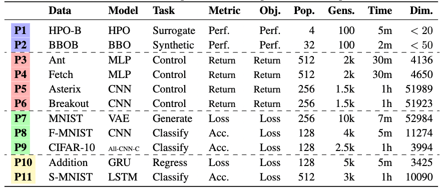

# `NeuroEvoBench`: Benchmarking Neuroevolution Methods for Machine Learning Applications 🦕 🦖 🐢
<a href="docs/logo.png"></a>
This repository contains benchmark results, helper scripts, ES configurations and logs for testing the performance of evolutionary strategies in [`evosax`](https://github.com/RobertTLange/evosax/) and [`EvoJAX`](https://github.com/google/evojax).

The benchmark is meant to facilitate benchmarking of evolutionary optimization (EO) methods specifically tailored towards neuroevolution methods.

All task evaluations are written in JAX so that population evaluations can be parallelized on accelerators (GPU/TPU). This reduces the evaluation times significantly.

## Task Availability



## Basic `NeuroEvoBench` Usage

### Individual Benchmark Tasks

- Note that the strategy to be evaluated has to follow the [`evosax`](https://github.com/RobertTLange/evosax/) `ask`-`tell` API.

```python
from evosax import Strategies
from neuroevobench.problems.cifar import CifarPolicy
from neuroevobench.problems.cifar import CifarTask
from neuroevobench.problems.cifar import CifarEvaluator

# 1. Create placeholder env to get number of actions for policy init
policy = CifarPolicy()

# 2. Define train/test task based on configs/eval settings
train_task = CifarTask(config.task_config.batch_size, test=False)
test_task = CifarTask(10000, test=True)

# 3. Setup task evaluator with strategy and policy
evaluator = CifarEvaluator(
    policy=policy,
    train_task=train_task,
    test_task=test_task,
    popsize=config.popsize,
    es_strategy=Strategies[config.strategy_name],
    es_config=config.es_config,
    es_params=config.es_params,
    seed_id=config.seed_id,
    log=log,
)

# 4. Run the ES loop with logging
evaluator.run(config.num_generations, config.eval_every_gen)
```

### Running Parameter Search Sweeps

- Please visit `neuroevobench-analysis` for example configurations used for the 10 EO baselines.

- You can execute random search sweeps, multi-seed evaluations for the best found settings and individual training runs via the following command line shortcuts:

```
neb-search --config_fname ${CONFIG_FNAME} --seed_id ${SEED_ID} --experiment_dir ${EXPERIMENT_DIR}
neb-eval --config_fname ${CONFIG_FNAME} --seed_id ${SEED_ID} --experiment_dir ${EXPERIMENT_DIR}
neb-run --config_fname ${CONFIG_FNAME} --seed_id ${SEED_ID} --experiment_dir ${EXPERIMENT_DIR}
```

## Installation & Setup

```
conda create -n es_bench python=3.9
source activate es_bench
pip install "jax[cuda11_cudnn82]" -f https://storage.googleapis.com/jax-releases/jax_cuda_releases.html
pip install -e .
```
